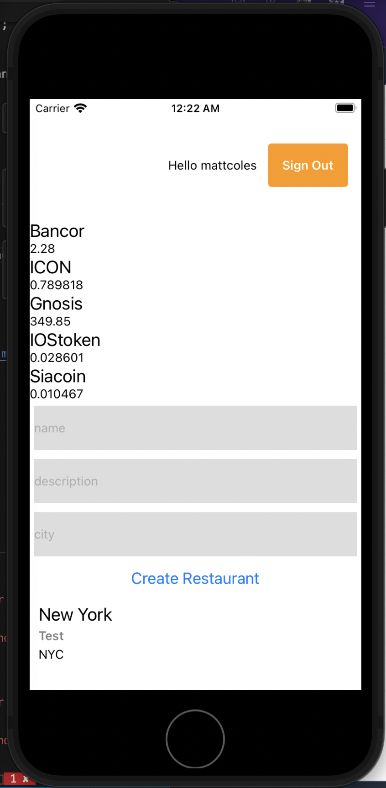

## Lab 5 - REST API with a Lambda Function

---

### Adding an API Endpoint

Now that we've created the cryptocurrency Lambda function let's add an API endpoint so we can invoke it via http.

To add the REST API, we can use the following command:

```sh
$ amplify add api

? Please select from one of the above mentioned services: REST
? Provide a friendly name for your resource that will be used to label this category in the project: cryptoapi   
? Provide a path (e.g., /items): /coins   
? Choose lambda source: Use a Lambda function already added in the current Amplify project   
? Choose the Lambda function to invoke by this path: cryptofunction   
? Restrict API access: Y
? Who should have access? Authenticated users only
? What kind of access do you want for Authenticated users: read/create/update/delete
? Do you want to add another path? (y/N) N  
```

Now the resources have been created & configured & we can push them to our account: 

```bash
$ amplify push

? Are you sure you want to continue? Y
```

---

### Interacting with the new API

Now that the API is created we can start sending requests to it & interacting with it.

Let's request some data from the API:

```js
// App.js
import React from 'react';
import {
  SafeAreaView,
  View,
  StyleSheet,
  Text,
  TextInput,
  Button
} from 'react-native';

// imports from Amplify library
import { withAuthenticator } from 'aws-amplify-react-native'
import { API, graphqlOperation, Auth } from 'aws-amplify'
import Amplify from 'aws-amplify';
import config from './src/aws-exports';

// import the GraphQL query
import { listRestaurants } from './src/graphql/queries'
// import the GraphQL mutation
import { createRestaurant } from './src/graphql/mutations'

Amplify.configure(config);

// create client ID
import { v4 as uuid } from 'uuid'
const CLIENTID = uuid()

class App extends React.Component {
  // add additional state to hold form state as well as restaurant data returned from the API
  state = {
    name: '', description: '', city: '', restaurants: [], coins: []
  }
  // execute the query in componentDidMount
  async componentDidMount() {
    try {
      const restaurantData = await API.graphql(graphqlOperation(listRestaurants))
      console.log('restaurantData:', restaurantData)
      this.setState({
        restaurants: restaurantData.data.listRestaurants.items
      })
    } catch (err) {
      console.log('error fetching restaurant data...', err)
    }
    try {
      const data = await API.get('cryptoapi', '/coins?limit=5&start=100')
      console.log('data from Lambda REST API: ', data)
      this.setState({ coins: data.coins })
    } catch (err) {
      console.log('error fetching coin data...', err)
    }
  }
  // this method calls the API and creates the mutation
  createRestaurant = async() => {
    const { name, description, city  } = this.state
    // store the restaurant data in a variable
    const restaurant = {
      name, description, city, clientId: CLIENTID
    }
    // perform an optimistic response to update the UI immediately
    const restaurants = [...this.state.restaurants, restaurant]
    this.setState({
      restaurants,
      name: '', description: '', city: ''
      })
    try {
      // make the API call
      await API.graphql(graphqlOperation(createRestaurant, {
        input: restaurant
      }))
      console.log('item created!')
    } catch (err) {
      console.log('error creating restaurant...', err)
    }
  }
  // change form state then user types into input
  onChange = (key, value) => {
    this.setState({ [key]: value })
  }
  render() {
    return (
      <SafeAreaView style={styles.container}>
        <View>
        {
          this.state.coins.map((c, i) => (
            <View key={i} style={styles.row}>
              <Text style={styles.name}>{c.name}</Text>
              <Text>{c.price_usd}</Text>
            </View>
          ))
        }
      </View>
        <TextInput
          style={{ height: 50, margin: 5, backgroundColor: "#ddd" }}
          onChangeText={v => this.onChange('name', v)}
          value={this.state.name} placeholder='name'
        />
        <TextInput
          style={{ height: 50, margin: 5, backgroundColor: "#ddd" }}
          onChangeText={v => this.onChange('description', v)}
          value={this.state.description} placeholder='description'
        />
        <TextInput
          style={{ height: 50, margin: 5, backgroundColor: "#ddd" }}
          onChangeText={v => this.onChange('city', v)}
          value={this.state.city} placeholder='city'
        />
        <Button onPress={this.createRestaurant} title='Create Restaurant' />
        {
          this.state.restaurants.map((restaurant, index) => (
            <View key={index} style={styles.item}>
              <Text style={styles.name}>{restaurant.name}</Text>
              <Text style={styles.description}>{restaurant.description}</Text>
              <Text style={styles.city}>{restaurant.city}</Text>
            </View>
          ))
        }
      </SafeAreaView>
    )
  }
}

const styles = StyleSheet.create({
  container: {
    flex: 1,
    justifyContent: 'center',
  },
  item: { padding: 10 },
  name: { fontSize: 20 },
  description: { fontWeight: '600', marginTop: 4, color: 'rgba(0, 0, 0, .5)' },
  city: { marginTop: 4 }
})

export default withAuthenticator(App, { includeGreetings: true });
```

You should now be able to see coin prices within the app:


---

## Let's move to Lab 6!
### [Lab 6 - Analytics](../06-analytics/README.md)