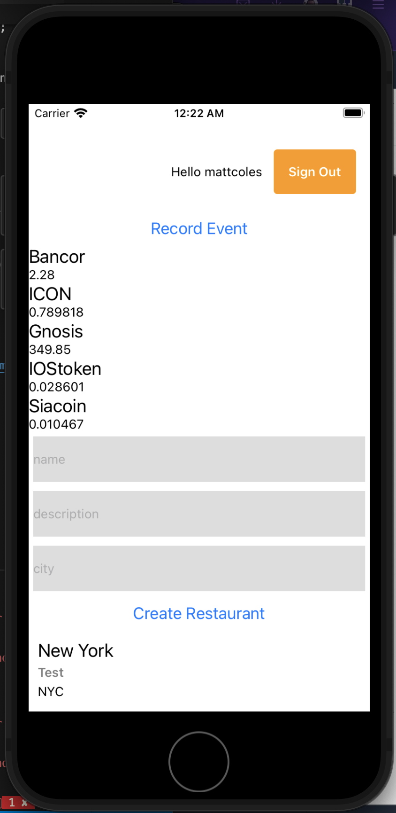

## Lab 6 - Analytics

---

### Adding Analytics
To add analytics, we can use the following command:

```sh
$ amplify add analytics
```

> Next, we'll be prompted for the following:

- Provide your pinpoint resource name: __amplifyanalytics__   
- Apps need authorization to send analytics events. Do you want to allow guest/unauthenticated users to send analytics events (recommended when getting started)? __Y__   

To deploy, run the `push` command:

```sh
$ amplify push
```

---

### Recording events

Now that the service has been created we can now begin recording events.

To record analytics events, we need to import the `Analytics` class from Amplify & then call `Analytics.record`:

```js
import React from 'react';
import {
  SafeAreaView,
  View,
  StyleSheet,
  Text,
  TextInput,
  Button
} from 'react-native';

// imports from Amplify library
import { withAuthenticator } from 'aws-amplify-react-native'
import { API, graphqlOperation, Analytics, Auth } from 'aws-amplify'
import Amplify from 'aws-amplify';
import config from './src/aws-exports';

// import the GraphQL query
import { listRestaurants } from './src/graphql/queries'
// import the GraphQL mutation
import { createRestaurant } from './src/graphql/mutations'

Amplify.configure(config);

// create client ID
import { v4 as uuid } from 'uuid'
const CLIENTID = uuid()

class App extends React.Component {
  // add additional state to hold form state as well as restaurant data returned from the API
  state = {
    name: '', description: '', city: '', restaurants: [], coins: [], username: ''
  }
  // execute the query in componentDidMount
  async componentDidMount() {
    try {
      const restaurantData = await API.graphql(graphqlOperation(listRestaurants))
      console.log('restaurantData:', restaurantData)
      this.setState({
        restaurants: restaurantData.data.listRestaurants.items
      })
    } catch (err) {
      console.log('error fetching restaurant data...', err)
    }
    try {
      const data = await API.get('cryptoapi', '/coins?limit=5&start=100')
      console.log('data from Lambda REST API: ', data)
      this.setState({ coins: data.coins })
    } catch (err) {
      console.log('error fetching coin data...', err)
    }
    try {
      const user = await Auth.currentAuthenticatedUser()
      this.setState({ username: user.username })
    } catch (err) {
      console.log('error getting user: ', err)
    }
  }
  recordEvent = () => {
    Analytics.record({
      name: 'My test event',
      attributes: {
        username: this.state.username
      }
    })
  }
  // this method calls the API and creates the mutation
  createRestaurant = async() => {
    const { name, description, city  } = this.state
    // store the restaurant data in a variable
    const restaurant = {
      name, description, city, clientId: CLIENTID
    }
    // perform an optimistic response to update the UI immediately
    const restaurants = [...this.state.restaurants, restaurant]
    this.setState({
      restaurants,
      name: '', description: '', city: ''
      })
    try {
      // make the API call
      await API.graphql(graphqlOperation(createRestaurant, {
        input: restaurant
      }))
      console.log('item created!')
    } catch (err) {
      console.log('error creating restaurant...', err)
    }
  }
  // change form state then user types into input
  onChange = (key, value) => {
    this.setState({ [key]: value })
  }
  render() {
    return (
      <SafeAreaView style={styles.container}>
        <Button onPress={this.recordEvent} title='Record Event' />
        <View>
        {
          this.state.coins.map((c, i) => (
            <View key={i} style={styles.row}>
              <Text style={styles.name}>{c.name}</Text>
              <Text>{c.price_usd}</Text>
            </View>
          ))
        }
      </View>
        <TextInput
          style={{ height: 50, margin: 5, backgroundColor: "#ddd" }}
          onChangeText={v => this.onChange('name', v)}
          value={this.state.name} placeholder='name'
        />
        <TextInput
          style={{ height: 50, margin: 5, backgroundColor: "#ddd" }}
          onChangeText={v => this.onChange('description', v)}
          value={this.state.description} placeholder='description'
        />
        <TextInput
          style={{ height: 50, margin: 5, backgroundColor: "#ddd" }}
          onChangeText={v => this.onChange('city', v)}
          value={this.state.city} placeholder='city'
        />
        <Button onPress={this.createRestaurant} title='Create Restaurant' />
        {
          this.state.restaurants.map((restaurant, index) => (
            <View key={index} style={styles.item}>
              <Text style={styles.name}>{restaurant.name}</Text>
              <Text style={styles.description}>{restaurant.description}</Text>
              <Text style={styles.city}>{restaurant.city}</Text>
            </View>
          ))
        }
      </SafeAreaView>
    )
  }
}

const styles = StyleSheet.create({
  container: {
    flex: 1,
    justifyContent: 'center',
  },
  item: { padding: 10 },
  name: { fontSize: 20 },
  description: { fontWeight: '600', marginTop: 4, color: 'rgba(0, 0, 0, .5)' },
  city: { marginTop: 4 }
})

export default withAuthenticator(App, { includeGreetings: true });
```

To view the analytics in the console, run the `console` command and navigate to the events tab:

```sh
$ amplify console analytics
```

In the console, click on __Analytics__, then click on __View  in Pinpoint__. In the __Pinpoint__ console, click on __events__ and then enable filters.

Also, you should now be able to see an Analytics button within the app:


---

## Let's move to Lab 7!
### [Lab 7 - Adding Storage with Amazon S3](../07-storage/README.md)