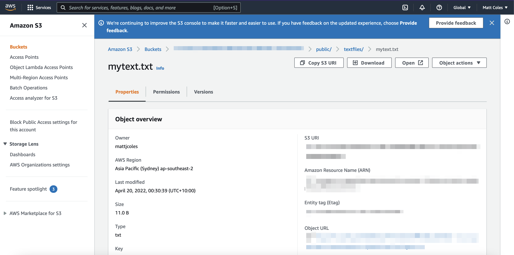

## Lab 7 - Adding Storage with Amazon S3

---

### Adding Storage
To add storage, we can use the following command:

```sh
amplify add storage
```

> Answer the following questions   

- Please select from one of the below mentioned services __Content (Images, audio, video, etc.)__
- Please provide a friendly name for your resource that will be used to label this category in the
 project: __rnworkshopstorage__
- Please provide bucket name: __YOUR_UNIQUE_BUCKET_NAME__
- Who should have access: __Auth users only__
- What kind of access do you want for Authenticated users?

```sh
❯◉ create/update
❯◉ read
❯◉ delete
```

- What kind of access do you want for Authenticated users?

```sh
amplify push
```

Now, storage is configured & ready to use.

What we've done above is created configured an Amazon S3 bucket that we can now start using for storing items.

For example, if we wanted to test it out we could store some text in a file like this:

```js
import React from 'react';
import {
  SafeAreaView,
  View,
  StyleSheet,
  Text,
  TextInput,
  Button
} from 'react-native';

// imports from Amplify library
import { withAuthenticator } from 'aws-amplify-react-native'
import { API, graphqlOperation, Analytics, Auth, Storage } from 'aws-amplify'
import Amplify from 'aws-amplify';
import config from './src/aws-exports';

// import the GraphQL query
import { listRestaurants } from './src/graphql/queries'
// import the GraphQL mutation
import { createRestaurant } from './src/graphql/mutations'

Amplify.configure(config);

// create client ID
import { v4 as uuid } from 'uuid'
const CLIENTID = uuid()

class App extends React.Component {
  // add additional state to hold form state as well as restaurant data returned from the API
  state = {
    name: '', description: '', city: '', restaurants: [], coins: [], username: ''
  }
  // execute the query in componentDidMount
  async componentDidMount() {
    try {
      const restaurantData = await API.graphql(graphqlOperation(listRestaurants))
      console.log('restaurantData:', restaurantData)
      this.setState({
        restaurants: restaurantData.data.listRestaurants.items
      })
    } catch (err) {
      console.log('error fetching restaurant data...', err)
    }
    try {
      const data = await API.get('cryptoapi', '/coins?limit=5&start=100')
      console.log('data from Lambda REST API: ', data)
      this.setState({ coins: data.coins })
    } catch (err) {
      console.log('error fetching coin data...', err)
    }
    try {
      const user = await Auth.currentAuthenticatedUser()
      this.setState({ username: user.username })
    } catch (err) {
      console.log('error getting user: ', err)
    }
  }
  recordEvent = () => {
    Analytics.record({
      name: 'My test event',
      attributes: {
        username: this.state.username
      }
    })
  }
  // create function to work with Storage
  addToStorage = () => {
    Storage.put('textfiles/mytext.txt', `Hello World`)
      .then (result => {
        console.log('result: ', result)
      })
      .catch(err => console.log('error: ', err));
  }
  // this method calls the API and creates the mutation
  createRestaurant = async() => {
    const { name, description, city  } = this.state
    // store the restaurant data in a variable
    const restaurant = {
      name, description, city, clientId: CLIENTID
    }
    // perform an optimistic response to update the UI immediately
    const restaurants = [...this.state.restaurants, restaurant]
    this.setState({
      restaurants,
      name: '', description: '', city: ''
      })
    try {
      // make the API call
      await API.graphql(graphqlOperation(createRestaurant, {
        input: restaurant
      }))
      console.log('item created!')
    } catch (err) {
      console.log('error creating restaurant...', err)
    }
  }
  // change form state then user types into input
  onChange = (key, value) => {
    this.setState({ [key]: value })
  }
  render() {
    return (
      <SafeAreaView style={styles.container}>
        <Button onPress={this.addToStorage} title='Add to Storage' />
        <Button onPress={this.recordEvent} title='Record Event' />
        <View>
        {
          this.state.coins.map((c, i) => (
            <View key={i} style={styles.row}>
              <Text style={styles.name}>{c.name}</Text>
              <Text>{c.price_usd}</Text>
            </View>
          ))
        }
      </View>
        <TextInput
          style={{ height: 50, margin: 5, backgroundColor: "#ddd" }}
          onChangeText={v => this.onChange('name', v)}
          value={this.state.name} placeholder='name'
        />
        <TextInput
          style={{ height: 50, margin: 5, backgroundColor: "#ddd" }}
          onChangeText={v => this.onChange('description', v)}
          value={this.state.description} placeholder='description'
        />
        <TextInput
          style={{ height: 50, margin: 5, backgroundColor: "#ddd" }}
          onChangeText={v => this.onChange('city', v)}
          value={this.state.city} placeholder='city'
        />
        <Button onPress={this.createRestaurant} title='Create Restaurant' />
        {
          this.state.restaurants.map((restaurant, index) => (
            <View key={index} style={styles.item}>
              <Text style={styles.name}>{restaurant.name}</Text>
              <Text style={styles.description}>{restaurant.description}</Text>
              <Text style={styles.city}>{restaurant.city}</Text>
            </View>
          ))
        }
      </SafeAreaView>
    )
  }
}

const styles = StyleSheet.create({
  container: {
    flex: 1,
    justifyContent: 'center',
  },
  item: { padding: 10 },
  name: { fontSize: 20 },
  description: { fontWeight: '600', marginTop: 4, color: 'rgba(0, 0, 0, .5)' },
  city: { marginTop: 4 }
})

export default withAuthenticator(App, { includeGreetings: true });
```

This would create a folder called `textfiles` in our S3 bucket & store a file called __mytext.txt__ there with the code we specified in the second argument of `Storage.put`.

You can view the created file if you open the AWS Console and navigate to S3 -> then the bucket name.


If we want to read everything from this folder, we can use `Storage.list`:

```js
import React from 'react';
import {
  SafeAreaView,
  View,
  StyleSheet,
  Text,
  TextInput,
  Button
} from 'react-native';

// imports from Amplify library
import { withAuthenticator } from 'aws-amplify-react-native'
import { API, graphqlOperation, Analytics, Auth, Storage } from 'aws-amplify'
import Amplify from 'aws-amplify';
import config from './src/aws-exports';

// import the GraphQL query
import { listRestaurants } from './src/graphql/queries'
// import the GraphQL mutation
import { createRestaurant } from './src/graphql/mutations'

Amplify.configure(config);

// create client ID
import { v4 as uuid } from 'uuid'
const CLIENTID = uuid()

class App extends React.Component {
  // add additional state to hold form state as well as restaurant data returned from the API
  state = {
    name: '', description: '', city: '', restaurants: [], coins: [], username: ''
  }
  // execute the query in componentDidMount
  async componentDidMount() {
    try {
      const restaurantData = await API.graphql(graphqlOperation(listRestaurants))
      console.log('restaurantData:', restaurantData)
      this.setState({
        restaurants: restaurantData.data.listRestaurants.items
      })
    } catch (err) {
      console.log('error fetching restaurant data...', err)
    }
    try {
      const data = await API.get('cryptoapi', '/coins?limit=5&start=100')
      console.log('data from Lambda REST API: ', data)
      this.setState({ coins: data.coins })
    } catch (err) {
      console.log('error fetching coin data...', err)
    }
    try {
      const user = await Auth.currentAuthenticatedUser()
      this.setState({ username: user.username })
    } catch (err) {
      console.log('error getting user: ', err)
    }
  }
  recordEvent = () => {
    Analytics.record({
      name: 'My test event',
      attributes: {
        username: this.state.username
      }
    })
  }
  // create function to work with Storage
  addToStorage = () => {
    Storage.put('textfiles/mytext.txt', `Hello World`)
      .then (result => {
        console.log('result: ', result)
      })
      .catch(err => console.log('error: ', err));
  }
  // Read storage
  readFromStorage = () => {
    Storage.list('textfiles/')
      .then(data => console.log('data from S3: ', data))
      .catch(err => console.log('error fetching from S3', err))
  }
  // this method calls the API and creates the mutation
  createRestaurant = async() => {
    const { name, description, city  } = this.state
    // store the restaurant data in a variable
    const restaurant = {
      name, description, city, clientId: CLIENTID
    }
    // perform an optimistic response to update the UI immediately
    const restaurants = [...this.state.restaurants, restaurant]
    this.setState({
      restaurants,
      name: '', description: '', city: ''
      })
    try {
      // make the API call
      await API.graphql(graphqlOperation(createRestaurant, {
        input: restaurant
      }))
      console.log('item created!')
    } catch (err) {
      console.log('error creating restaurant...', err)
    }
  }
  // change form state then user types into input
  onChange = (key, value) => {
    this.setState({ [key]: value })
  }
  render() {
    return (
      <SafeAreaView style={styles.container}>
        <Button onPress={this.addToStorage} title='Add to Storage' />
        <Button onPress={this.readFromStorage} title='Read Storage' />
        <Button onPress={this.recordEvent} title='Record Event' />
        <View>
        {
          this.state.coins.map((c, i) => (
            <View key={i} style={styles.row}>
              <Text style={styles.name}>{c.name}</Text>
              <Text>{c.price_usd}</Text>
            </View>
          ))
        }
      </View>
        <TextInput
          style={{ height: 50, margin: 5, backgroundColor: "#ddd" }}
          onChangeText={v => this.onChange('name', v)}
          value={this.state.name} placeholder='name'
        />
        <TextInput
          style={{ height: 50, margin: 5, backgroundColor: "#ddd" }}
          onChangeText={v => this.onChange('description', v)}
          value={this.state.description} placeholder='description'
        />
        <TextInput
          style={{ height: 50, margin: 5, backgroundColor: "#ddd" }}
          onChangeText={v => this.onChange('city', v)}
          value={this.state.city} placeholder='city'
        />
        <Button onPress={this.createRestaurant} title='Create Restaurant' />
        {
          this.state.restaurants.map((restaurant, index) => (
            <View key={index} style={styles.item}>
              <Text style={styles.name}>{restaurant.name}</Text>
              <Text style={styles.description}>{restaurant.description}</Text>
              <Text style={styles.city}>{restaurant.city}</Text>
            </View>
          ))
        }
      </SafeAreaView>
    )
  }
}

const styles = StyleSheet.create({
  container: {
    flex: 1,
    justifyContent: 'center',
  },
  item: { padding: 10 },
  name: { fontSize: 20 },
  description: { fontWeight: '600', marginTop: 4, color: 'rgba(0, 0, 0, .5)' },
  city: { marginTop: 4 }
})

export default withAuthenticator(App, { includeGreetings: true });
```

You should now be able to see a ```Read Storage``` button within the app and when tapped, you'll see in the Expo terminal logs the output of uploaded files:


If we only want to read the single file, we can modify the readFromStorage method to use `Storage.get`:

```js
readFromStorage = () => {
  Storage.get('textfiles/mytext.txt')
    .then(data => {
      console.log('data from S3: ', data)
      fetch(data)
        .then(r => r.text())
        .then(text => {
          console.log('text: ', text)
        })
        .catch(e => console.log('error fetching text: ', e))
    })
    .catch(err => console.log('error fetching from S3', err))
}
```

If we wanted to pull down everything, we can use `Storage.list`:

```js
readFromStorage = () => {
  Storage.list('')
    .then(data => console.log('data from S3: ', data))
    .catch(err => console.log('error fetching from S3', err))
}
```

---

## Let's move to Lab 8!
### [Lab 8 - Multiple Serverless Environments](../08-multienv/README.md)